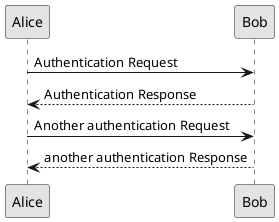
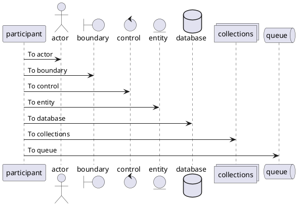
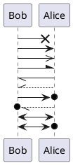
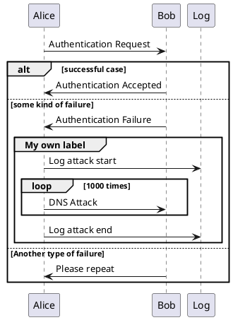
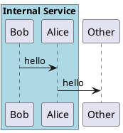
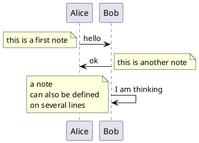
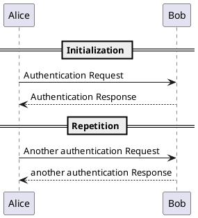

### リファレンス

https://plantuml.com/ja/sequence-diagram

### 基本

```plantuml
@startuml
skinparam monochrome true
Alice -> Bob: Authentication Request
Bob --> Alice: Authentication Response

Alice -> Bob: Another authentication Request
Alice <-- Bob: another authentication Response
@enduml
```

### 分類子の形

```plantuml
@startuml
participant participant as Foo
actor       actor       as Foo1
boundary    boundary    as Foo2
control     control     as Foo3
entity      entity      as Foo4
database    database    as Foo5
collections collections as Foo6
queue       queue       as Foo7
Foo -> Foo1 : To actor 
Foo -> Foo2 : To boundary
Foo -> Foo3 : To control
Foo -> Foo4 : To entity
Foo -> Foo5 : To database
Foo -> Foo6 : To collections
Foo -> Foo7: To queue
@enduml
```

### 矢印の形

```plantuml
@startuml
Bob ->x Alice
Bob -> Alice
Bob ->> Alice
Bob -\ Alice
Bob \\- Alice
Bob //-- Alice

Bob ->o Alice
Bob o\\-- Alice

Bob <-> Alice
Bob <->o Alice
@enduml
```

### グループ

```plantuml
@startuml
Alice -> Bob: Authentication Request

alt successful case

    Bob -> Alice: Authentication Accepted

else some kind of failure

    Bob -> Alice: Authentication Failure
    group My own label
    Alice -> Log : Log attack start
        loop 1000 times
            Alice -> Bob: DNS Attack
        end
    Alice -> Log : Log attack end
    end

else Another type of failure

   Bob -> Alice: Please repeat

end
@enduml
```

### 分類子の囲み

```plantuml
@startuml

box "Internal Service" #LightBlue
participant Bob
participant Alice
end box
participant Other

Bob -> Alice : hello
Alice -> Other : hello

@enduml
```

### ノート

```plantuml
@startuml
Alice->Bob : hello
note left: this is a first note

Bob->Alice : ok
note right: this is another note

Bob->Bob : I am thinking
note left
a note
can also be defined
on several lines
end note
@enduml
```

### 境界線

```plantuml
@startuml

== Initialization ==

Alice -> Bob: Authentication Request
Bob --> Alice: Authentication Response

== Repetition ==

Alice -> Bob: Another authentication Request
Alice <-- Bob: another authentication Response

@enduml
```
